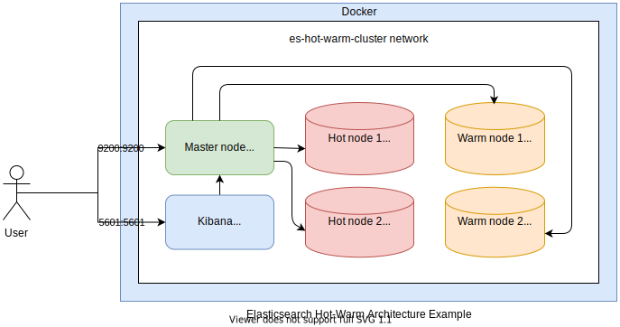

This is an example show how an elasticsearch hot-warm architecture is configured using docker and dockercompose

* **Note:** This example is only tested on a linux environment so it may fail on other environments



## Use case

* Combine with [ILM](https://www.elastic.co/guide/en/elasticsearch/reference/current/getting-started-index-lifecycle-management.html) for data rollover

## Requirement

* [Docker](https://docs.docker.com/get-docker/)
* [Docker Compose](https://docs.docker.com/compose/install/)

## Install

0. Update `vm.max_map_count` field if you haven't done it before

```bash
sudo sysctl -w vm.max_map_count=262144
```

1. Create a network named `es-hot-warm-cluster`

```bash
docker network create es-hot-warm-cluster
```

2. Build & run

```bash
docker-compose up -d --build
```

3. Shut down

```bash
docker-compose down
```